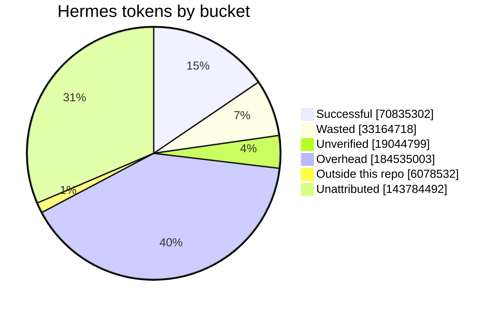

# Hermes observability report

> Generated by `bun run agent:evaluate` (task PSI-099) at 2026-09-26T14:53:15.379Z. Data window 2026-09-19T09:02:07.029Z → 2026-09-26T14:46:57.703Z (UTC).
> Everything below is recomputed from read-only sources on each run; change prices, budget or thresholds in `agent-evaluate/config.json` and re-run.

## 1. Summary

- **Volume:** Hermes (OmniRoute key `production-key`) made 5,633 upstream LLM attempts; 1,244 failed (22.1%). Successful calls moved 426.12M prompt tokens (78.0% served from cache) and 1.81M completion tokens.
- **Compute split (tokens):** successful 15.5% · wasted 7.3% · unverified 4.2% · overhead 40.3% · outside repo 1.3% · unattributed 31.4%.
- **Cost at config prices:** $13.44 total, $3.17 wasted, $2.66 successful. Per successful task: $0.1724 direct, $0.4979 fully loaded (27 successful tasks). Only providers with a price in the config carry dollars; see §7 for billed money.
- **Outcomes:** pass@1 = 93.1%, pass@2 = 93.1% over 29 resolved Hermes tasks.
- **cheaperinference billing:** billed $4.29 for 103.16M tokens (list $7.70). Actual vs expected cost per token: -53.8%. Tokens paid for but never delivered: +14.4% → **flagged: paid_for_undelivered**.
- **Waste signals:** 51 retry storms (> 3 failed attempts in one turn), 71 repeated identical tool calls (3.3%), 17 with identical output, 157 tool errors (7.3%), 2 truncated turns, 5 failed turns.

## 2. Sources, joins and coverage

| Source | What was read | Rows |
| --- | --- | --- |
| Hermes `state.db` | sessions, turns, tool calls (args hashed), tool results (status + hash only) | 22 sessions, 4,522 messages (508 compaction duplicates dropped) |
| OmniRoute `call_logs` | upstream attempts for `production-key` (routing summary rows and probes excluded) | 5,633 attempts; 82 routing-level failures not counted |
| agent-history | entries by `hermes` (outcome + checks) | 30 attempts on 29 tasks |
| docs/list-task-project.md | task status (human stamp = done) | 75 tasks |
| billing: cheaperinference | `data/billing/cheaperinference-2026-08-30_2026-09-26.csv` | 2 days |

- **Step join:** OmniRoute never records which Hermes turn a call served, so calls are matched by time (a successful call belongs to the Hermes turn stored ≤ 3 s after it; failed attempts to the turn that follows within 10 min). 47.0% of successful prompt tokens matched a turn, 19.3% matched only a run (auxiliary calls such as titles or compression), 33.6% matched nothing. 280 calls had candidate turns in more than one session.
- **Cross-check:** Hermes' own session counters hold 200.39M prompt tokens (76.3% cached) over 2,119 API calls; OmniRoute recorded 426.12M for the key. Hermes prices none of it (20 sessions have `cost_status = unknown`, estimated cost $0.00), which is why the cost calculator exists.
- **Estimates:** 199 failed attempts (5xx/499, usually still processed upstream) were given the token counts of the successful retry for the same request; OmniRoute logs them with 0 tokens.
- **Sessions:** 12 of 22 sessions ended as `startup_orphan_reap` (never closed); their runs hold 135.86M tokens.

## 3. Definitions

| Flag | Detector | Counts as waste |
| --- | --- | --- |
| `failed_attempt` | an upstream attempt for the turn returned non-200 | the failed attempt (tokens estimated for 5xx/499) |
| `retry_storm` | more than 3 failed attempts in one turn (`retry_threshold`) | via failed_attempt |
| `repeat_call` (loop_flag) | same tool + same args hash earlier in the same run | no (re-running a build after a fix is normal) |
| `no_new_info` | repeat_call whose output hash is also identical (low-information-gain proxy) | yes, the turn's share |
| `repeated_error` | repeat_call where both the earlier and this call errored (unrecoverable pattern) | yes, the turn's share |
| `invalid_tool_call` | unparseable arguments, or the tool rejected the call (unknown tool, bad args) | yes, the turn's share |
| `tool_error` | non-zero exit, `success: false`, error field or traceback | no (errors are often informative) |
| `truncated_output` | `finish_reason = length` | yes, the whole turn |
| `failed_turn` | Hermes marked the turn `failed_turn` | yes, the whole turn |
| `budget_exceeded` | run spend already above `budget_usd_per_run` (not set) | yes, the whole turn |

- **Run:** the part of one Hermes session between branch switches (`git checkout|switch task/PSI-xxx` starts a task run; `master`/`main` starts overhead). Sessions whose working directory is outside this repo are `outside_repo`.
- **Task outcome:** `success` = task stamped `done` by a human (C-21) **and** the latest Hermes history attempt says `done` with typecheck, lint, build, db_reset, db_tests all `pass` or `n/a`. `failed` = a check failed, the attempt was blocked/abandoned, or the task is blocked. `unverified` = done but a check was `skipped` or no Hermes attempt exists. `pending` = not stamped done yet.
- **successful_compute** = tokens of successful task runs minus flagged waste. **wasted_compute** = every token of failed task runs + flagged waste in any run + failed unattributed attempts. The other buckets cannot be classified either way and are shown separately.
- **Token convention:** `prompt` = uncached input, `cached` = cache reads, `completion` = output incl. reasoning. OmniRoute's `tokens_in` includes cache reads and is split accordingly.

## 4. Wasted vs successful compute

| Bucket | Prompt | Cached | Completion | Total tokens | Share | Cost (config prices) |
| --- | --- | --- | --- | --- | --- | --- |
| Successful | 22.29M | 48.28M | 0.27M | 70.84M | 15.5% | $2.66 |
| Wasted | 13.48M | 19.59M | 0.09M | 33.16M | 7.3% | $3.17 |
| Unverified (merged, checks not proven) | 6.36M | 12.61M | 0.07M | 19.04M | 4.2% | $0.6220 |
| Pending (task not stamped done) | 0.00M | 0.00M | 0.00M | 0.00M | 0.0% | $0.00 |
| Overhead (not on a task branch) | 35.60M | 147.99M | 0.94M | 184.54M | 40.3% | $1.34 |
| Outside this repo | 1.68M | 4.33M | 0.07M | 6.08M | 1.3% | $0.00 |
| Unattributed (no Hermes turn within 10 min) | 25.57M | 117.76M | 0.45M | 143.78M | 31.4% | $5.65 |
| **Total** | 104.98M | 350.57M | 1.89M | 457.44M | 100% | $13.44 |

## 5. Tasks

| Task | Status | Attempts (verdicts) | Outcome | Runs | Hermes activity (UTC) | History entry claims | Tokens | Cost | Waste |
| --- | --- | --- | --- | --- | --- | --- | --- | --- | --- |
| PSI-001 | done | 0 | unverified | 1 | 09-24T14:27 → 09-25T02:05 |  | 8.99M | $0.6567 | 21.0% |
| PSI-002 | done | 0 | unverified | 1 | 09-25T02:11 → 09-25T02:24 |  | 7.00M | $0.00 | 3.6% |
| PSI-004 | done | 1 (unverified) | unverified | 1 | 09-24T11:43 → 09-24T14:27 | 09-24T18:30 → 09-24T18:50 ⚠ | 6.58M | $0.5196 | 21.1% |
| PSI-007 | done | 1 (pass) | success | 0 | no run found | 09-25T06:10 → 09-25T06:30 | 0.00M | $0.00 | n/a |
| PSI-009 | done | 1 (pass) | success | 0 | no run found | 09-25T12:30 → 09-25T12:55 | 0.00M | $0.00 | n/a |
| PSI-010 | done | 2 (pass\|pass) | success | 0 | no run found | 09-25T09:15 → 09-25T09:35 | 0.00M | $0.00 | n/a |
| PSI-012 | done | 1 (unverified) | unverified | 0 | no run found | 09-25T08:00 → 09-25T08:15 | 0.00M | $0.00 | n/a |
| PSI-013 | done | 1 (pass) | success | 0 | no run found | 09-25T09:47 → 09-25T10:05 | 0.00M | $0.00 | n/a |
| PSI-014 | done | 1 (pass) | success | 0 | no run found | 09-25T10:10 → 09-25T10:30 | 0.00M | $0.00 | n/a |
| PSI-015 | done | 1 (pass) | success | 0 | no run found | 09-25T10:35 → 09-25T11:10 | 0.00M | $0.00 | n/a |
| PSI-016 | done | 1 (pass) | success | 0 | no run found | 09-25T13:30 → 09-25T13:55 | 0.00M | $0.00 | n/a |
| PSI-017 | done | 1 (pass) | success | 0 | no run found | 09-25T14:00 → 09-25T14:25 | 0.00M | $0.00 | n/a |
| PSI-018 | done | 1 (pass) | success | 0 | no run found | 09-25T14:30 → 09-25T14:55 | 0.00M | $0.00 | n/a |
| PSI-019 | done | 1 (pass) | success | 0 | no run found | 09-25T15:00 → 09-25T15:30 | 0.00M | $0.00 | n/a |
| PSI-020 | done | 1 (pass) | success | 0 | no run found | 09-26T02:00 → 09-26T02:25 | 0.00M | $0.00 | n/a |
| PSI-021 | done | 1 (pass) | success | 0 | no run found | 09-26T02:30 → 09-26T02:50 | 0.00M | $0.00 | n/a |
| PSI-022 | done | 1 (pass) | success | 0 | no run found | 09-26T03:00 → 09-26T03:30 | 0.00M | $0.00 | n/a |
| PSI-023 | done | 1 (pass) | success | 0 | no run found | 09-26T03:30 → 09-26T03:55 | 0.00M | $0.00 | n/a |
| PSI-024 | done | 1 (pass) | success | 0 | no run found | 09-26T04:00 → 09-26T04:30 | 0.00M | $0.00 | n/a |
| PSI-030 | done | 1 (pass) | success | 0 | no run found | 09-26T04:30 → 09-26T04:55 | 0.00M | $0.00 | n/a |
| PSI-034 | done | 1 (pass) | success | 0 | no run found | 09-26T05:00 → 09-26T05:25 | 0.00M | $0.00 | n/a |
| PSI-040 | done | 1 (pass) | success | 0 | no run found | 09-26T05:30 → 09-26T05:55 | 0.00M | $0.00 | n/a |
| PSI-041 | done | 1 (pass) | success | 0 | no run found | 09-26T06:00 → 09-26T06:25 | 0.00M | $0.00 | n/a |
| PSI-044 | done | 1 (pass) | success | 0 | no run found | 09-26T06:30 → 09-26T06:55 | 0.00M | $0.00 | n/a |
| PSI-050 | done | 1 (pass) | success | 1 | 09-26T04:12 → 09-26T04:22 | 09-26T07:00 → 09-26T07:25 ⚠ | 3.78M | $0.00 | 0.0% |
| PSI-051 | done | 1 (pass) | success | 1 | 09-26T04:22 → 09-26T05:09 | 09-26T07:30 → 09-26T07:55 ⚠ | 8.28M | $0.00 | 0.0% |
| PSI-052 | done | 1 (pass) | success | 1 | 09-26T05:11 → 09-26T05:45 | 09-26T08:00 → 09-26T08:20 ⚠ | 5.85M | $0.00 | 0.0% |
| PSI-053 | done | 1 (pass) | success | 1 | 09-26T05:45 → 09-26T08:23 | 09-26T08:30 → 09-26T08:50 ⚠ | 8.84M | $0.00 | 0.0% |
| PSI-060 | blocked | 0 | failed | 1 | 09-26T09:44 → 09-26T10:03 |  | 2.01M | $0.4015 | 100.0% |
| PSI-061 | done | 1 (pass) | success | 2 | 09-26T08:58 → 09-26T10:25 | 09-26T09:00 → 09-26T09:40 | 14.99M | $1.56 | 32.3% |
| PSI-067 | done | 1 (pass) | success | 1 | 09-26T10:26 → 09-26T13:50 | 09-26T10:10 → 09-26T10:45 | 35.10M | $2.41 | 30.2% |
| PSI-070 | done | 1 (pass) | success | 1 | 09-26T13:51 → 09-26T14:46 | 09-26T12:50 → 09-26T13:30 ⚠ | 17.71M | $0.6848 | 46.7% |

⚠ = the history entry's claimed session window does not overlap any Hermes activity on that task. Full data: `reports/tasks.csv`, `reports/runs.csv`.

## 6. Providers (Hermes key)

| Provider / model | Attempts | Failed | Prompt | Cached | Cache hit | Completion | Cost | Est. cost of failed | Price |
| --- | --- | --- | --- | --- | --- | --- | --- | --- | --- |
| antigravity / gemini-3.7-flash-high | 2,747 | 28 (1.0%) | 44.25M | 240.91M | 84.5% | 1.07M | $0.00 | $0.00 | assumed subscription, $0 per call |
| cheaperinference / deepseek-v4-flash-0731 | 701 | 79 (11.3%) | 10.45M | 54.35M | 83.9% | 0.23M | $4.35 | $0.0458 | example rate from the task brief (unconfirmed) |
| cheaperinference / deepseek-v4.1-flash | 475 | 159 (33.5%) | 15.51M | 8.96M | 36.6% | 0.15M | $3.52 | $2.20 | example rate from the task brief (unconfirmed) |
| cheaperinference / deepseek-v4-flash | 286 | 28 (9.8%) | 7.14M | 11.68M | 62.1% | 0.09M | $1.93 | $0.1591 | example rate from the task brief (unconfirmed) |
| grok-cli / grok-4.6 | 157 | 72 (45.9%) | 1.96M | 1.42M | 41.9% | 0.07M | $0.00 | $0.00 | assumed subscription, $0 per call |
| antigravity / claude-opus-4-6-thinking | 150 | 24 (16.0%) | 2.83M | 7.30M | 72.1% | 0.06M | $0.00 | $0.00 | assumed subscription, $0 per call |
| antigravity / gemini-pro-agent | 70 | 9 (12.9%) | 3.20M | 3.01M | 48.4% | 0.02M | $0.00 | $0.00 | assumed subscription, $0 per call |
| cheaperinference / gpt-5.6-luna | 69 | 27 (39.1%) | 2.57M | 0.88M | 25.5% | 0.02M | $0.5554 | $0.1526 | example rate from the task brief (unconfirmed) |
| grok-cli / grok-composer-2.5-fast | 56 | 49 (87.5%) | 0.42M | 0.02M | 4.8% | 0.01M | $0.00 | $0.00 | assumed subscription, $0 per call |
| grok-cli / grok-4.5 | 55 | 41 (74.6%) | 0.56M | 0.20M | 26.3% | 0.02M | $0.00 | $0.00 | assumed subscription, $0 per call |
| claude / claude-opus-4-5-20251101 | 48 | 48 (100.0%) | 0.00M | 0.00M | 0.0% | 0.00M | $0.00 | $0.00 | assumed subscription, $0 per call |
| github / gpt-4o-2024-11-20 | 45 | 22 (48.9%) | 0.19M | 0.40M | 68.2% | 0.00M | $0.00 | $0.00 | assumed subscription, $0 per call |
| claude / claude-sonnet-5 | 44 | 1 (2.3%) | 0.02M | 2.75M | 99.3% | 0.04M | $0.00 | $0.00 | assumed subscription, $0 per call |
| github / claude-opus-4.6 | 44 | 44 (100.0%) | 0.00M | 0.00M | 0.0% | 0.00M | $0.00 | $0.00 | assumed subscription, $0 per call |
| github / gpt-5.3-codex | 38 | 38 (100.0%) | 0.00M | 0.00M | 0.0% | 0.00M | $0.00 | $0.00 | assumed subscription, $0 per call |

Failed attempts by provider: **github** 565/596 (400 model_not_found ×353, 400 ×202, 429 rate_limited ×5); **cheaperinference** 317/1,575 (504 server_error ×290, 499 ×9, 503 server_error ×9); **grok-cli** 162/268 (429 rate_limited ×159, 499 ×3); **claude** 78/130 (400 ×48, 429 rate_limited ×30); **antigravity** 68/3,010 (499 ×20, 429 rate_limited ×18, 422 ×12); **opencode** 48/48 (401 model_not_found ×14, 400 ×13, 403 ×13); **kimi-coding** 4/4 (403 forbidden ×4); **openference** 2/2 (402 quota_exhausted ×2). OmniRoute's own ledger prices the key at $229.10 over 3,080 priced requests; that is its list-price view, including subscription providers, not money billed.

## 7. Actual vs expected cost per token

### cheaperinference

Actual = the provider's billing export. Expected = config price (example rate from the task brief (unconfirmed)) × the billed tokens. Delivered = tokens OmniRoute received back from successful calls on the models the bill lists (all API keys). Flag threshold: 10%. The per-day split assumes the export uses UTC days; the total does not depend on it.

| Period | Billed req | Billed tokens | Billed | List | Expected | Actual $/1M | Expected $/1M | Actual vs expected | Delivered req | Delivered tokens | Paid for undelivered | Flags |
| --- | --- | --- | --- | --- | --- | --- | --- | --- | --- | --- | --- | --- |
| 2026-09-24 | 147 | 8.26M | $0.7077 | $1.23 | $0.9200 | $0.0857 | $0.1114 | -23.1% | 105 | 6.10M | +35.3% | paid_for_undelivered |
| 2026-09-25 | 945 | 94.90M | $3.59 | $6.47 | $8.37 | $0.0378 | $0.0881 | -57.1% | 863 | 84.08M | +12.9% | paid_for_undelivered |
| total | 1,092 | 103.16M | $4.29 | $7.70 | $9.29 | $0.0416 | $0.0900 | -53.8% | 968 | 90.19M | +14.4% | paid_for_undelivered |

| Model | Billed requests | Delivered OK | Failed 5xx/499 | Billed − delivered |
| --- | --- | --- | --- | --- |
| deepseek-v4-flash-0731 | 699 | 625 | 80 | 74 |
| deepseek-v4-flash | 280 | 260 | 32 | 20 |
| gpt-5.6-luna | 48 | 44 | 31 | 4 |
| glm-5.2 | 23 | 13 | 9 | 10 |
| deepseek-v4.1-flash | 22 | 19 | 3 | 3 |
| glm-5.3-flash | 20 | 7 | 11 | 13 |
| gpt-oss-120b | 0 | 6 | 8 | -6 |
| gemini-2.5-flash | 0 | 5 | 2 | -5 |
| claude-haiku-4.5 | 0 | 3 | 2 | -3 |
| claude-sonnet-5 | 0 | 2 | 2 | -2 |
| deepseek-v4-pro | 0 | 2 | 0 | -2 |
| aion-labs.aion-2-0 | 0 | 2 | 26 | -2 |
| claude-fable-5 | 0 | 1 | 2 | -1 |
| claude-sonnet-4.5 | 0 | 1 | 0 | -1 |
| claude-sonnet-4.6 | 0 | 1 | 0 | -1 |
| glm-4.5-air | 0 | 1 | 1 | -1 |
| claude-opus-4.6 | 0 | 1 | 1 | -1 |
| gemini-3.1-flash-lite | 0 | 1 | 0 | -1 |
| glm-4.7 | 0 | 1 | 0 | -1 |
| gemini-3.7-flash | 0 | 1 | 1 | -1 |
| gpt-5.4-mini | 0 | 1 | 0 | -1 |
| gpt-5.4 | 0 | 1 | 0 | -1 |
| gpt-5.5 | 0 | 1 | 0 | -1 |
| gpt-5.6-sol | 0 | 1 | 0 | -1 |

Cross-check: billed minus delivered = 12.97M; the estimate for Hermes' timed-out cheaperinference attempts (each given its successful retry's tokens) = 3.04M, an upper bound because not every timeout reaches the bill (see "Failed 5xx/499" vs "Billed − delivered" above).

## 8. Waste signals

| Signal | Count | Rate |
| --- | --- | --- |
| Upstream attempts failed | 1,244 | 22.1% |
| Turns with ≥ 1 failed attempt (retry rate) | 305 | 14.4% |
| Retry storms (> 3 failed attempts) | 51 |  |
| Repeated identical tool calls (loop rate) | 71 | 3.3% |
| … with identical output (no new info) | 17 | 0.8% |
| … repeating an error | 1 | 0.0% |
| Invalid tool calls | 0 | 0.0% |
| Tool errors (tool error rate) | 157 | 7.3% |
| Truncated turns | 2 | 0.1% |
| Failed turns | 5 | 0.2% |
| Over budget | budget not set |  |

Most repeated: terminal ×48, read_file ×8, search_files ×5, skill_view ×4, write_file ×3. Tool error classes: exit_code ×92, not_found ×11, other ×28, exception ×18, timeout ×6, permission ×2. Turns: 2,161; tool calls: 2,164.

## 9. Recommendations

1. **cheaperinference: stop paying for timeouts.** The provider billed +14.4% more tokens than OmniRoute received (124 extra requests; 166 attempts ended in 5xx/499). Timed-out attempts gave up after a median 17.5 s while successful calls take up to 27.0 s (p95) / 125.2 s (max). Raise OmniRoute's upstream timeout for this provider above the p95, or stream responses, so a slow ~100K-token call is not billed, dropped and re-sent.
2. **Demote `github` in Hermes' fallback chains:** 565 of 596 attempts failed (400 model_not_found ×353, 400 ×202, 429 rate_limited ×5). Each failure adds latency before the next fallback.
3. **Demote `grok-cli` in Hermes' fallback chains:** 162 of 268 attempts failed (429 rate_limited ×159, 499 ×3). Each failure adds latency before the next fallback.
4. **Demote `claude` in Hermes' fallback chains:** 78 of 130 attempts failed (400 ×48, 429 rate_limited ×30). Each failure adds latency before the next fallback.
5. **Demote `opencode` in Hermes' fallback chains:** 48 of 48 attempts failed (401 model_not_found ×14, 400 ×13, 403 ×13). Each failure adds latency before the next fallback.
6. **Cut no-new-information repeats:** 17 tool calls repeated an earlier identical call in the same run and got identical output (terminal ×12, read_file ×3, skill_view ×1, browser_exec ×1).
7. **Truncated turns:** 2 turns stopped at the max output length (`finish_reason = length`); raise the output limit for those models or ask for smaller edits.
8. **Make history timestamps machine-recorded:** for 6 of 8 Hermes tasks the `session.started_at/ended_at` in the history entry does not overlap any Hermes activity on that task branch (PSI-004, PSI-050, PSI-051, PSI-052, …). Hermes should copy the times (and its session id) from its own session instead of writing them by hand; it also makes attempt-level pass@k possible.
9. **Exact attribution (phase B):** the join is time-based: 47.0% of prompt tokens tie to a turn, 19.3% only to a run, 33.6% to nothing, and 280 calls had candidates in two sessions. Give Hermes its own OmniRoute API key and add a Hermes plugin on the `post_llm_call` / `on_session_end` hooks that writes this JSONL live with exact usage and the current branch.
10. **Set a budget:** `budget_usd_per_run` is not set, so the budget monitor is idle. Task runs that cost money at config prices (7 of 12): $0.6567 median, $2.41 p90, $2.41 max.
11. **Confirm prices:** `cheaperinference` (example rate from the task brief (unconfirmed)); `antigravity` (assumed subscription, $0 per call); `claude` (assumed subscription, $0 per call); `github` (assumed subscription, $0 per call); `grok-cli` (assumed subscription, $0 per call). For reference, cheaperinference billed 0.46× the config price for the same tokens. Edit `agent-evaluate/config.json` and re-run; every dollar figure here scales with it.

## 10. Not available

- **Billed cost for providers without an export** (every provider except cheaperinference): priced from `config.json` only; subscription providers are assumed $0 per call.
- **Expected cost per run** and **budget per task:** not given in the brief (`budget_usd_per_run` = null).
- **Low information gain** beyond the `no_new_info` proxy (identical call + identical output): needs semantic judgement.
- **Attempt-level pass@k:** Hermes history entries do not carry real timestamps or the Hermes session id, so runs cannot be tied to a specific attempt; runs take their task's final outcome, and pass@k counts recorded attempts.
- **Re-running tests/build/lint for past runs:** the code has moved on; outcomes come from the recorded checks plus the human stamp.
- **Per-model billed tokens:** the billing export has tokens per day and request counts per model only.
- **Per-call gateway cost:** OmniRoute's cost ledger has no request id, so only its per-key total is shown.
